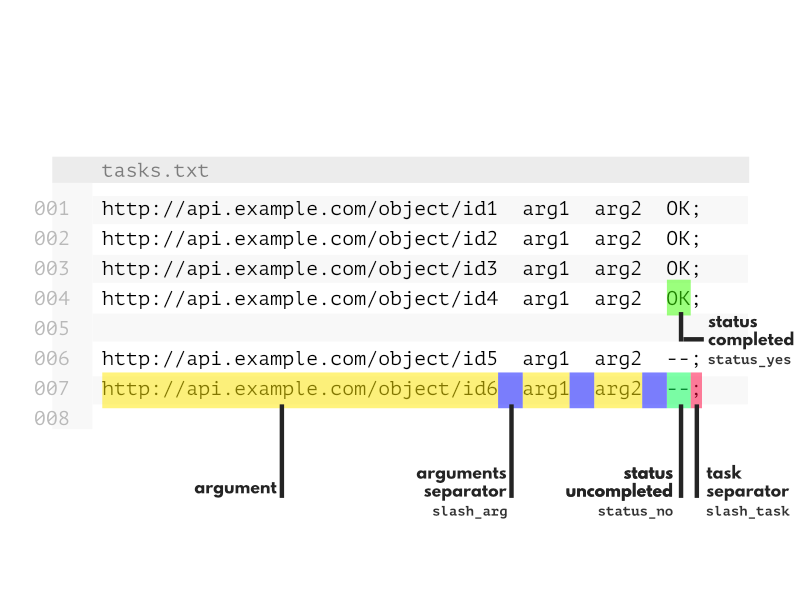

taskresume.py
=======

It's a little python script that manages tasks so that when you launch a big list of things to to you can cancel and resume the process.



To use it, just copy the `taskresume.py` file and put it in your branch.
On your main script, use it like this :
```
from taskresume import TaskBundle

taskbundle = TaskBundle(slash_task=",\n") # task manager, add arguments to overwrite format

taskbundle.loadFile('test_tasks.txt') # load source file

if taskbundle.hasLoadedList:
    for task in taskbundle.list :
        args = task.get('args')
        status = task.get('status')
        id = task.get('id')
        #...
        taskbundle.changeStatus(id, 'error') #--> error
        #taskbundle.changeStatus(id, 'yes') --> completed
        #taskbundle.changeStatus(id, 'no') --> not completed

```
